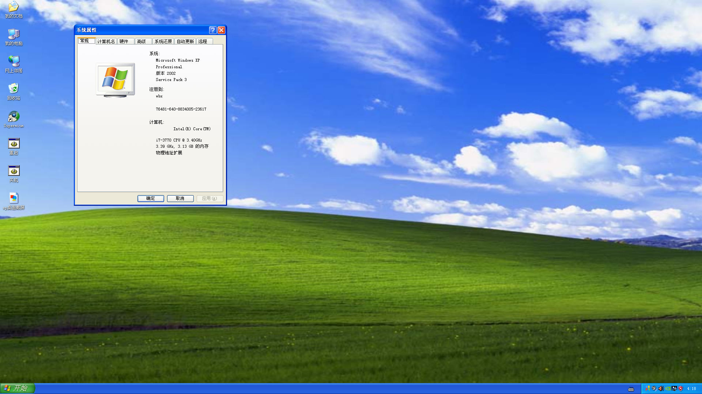
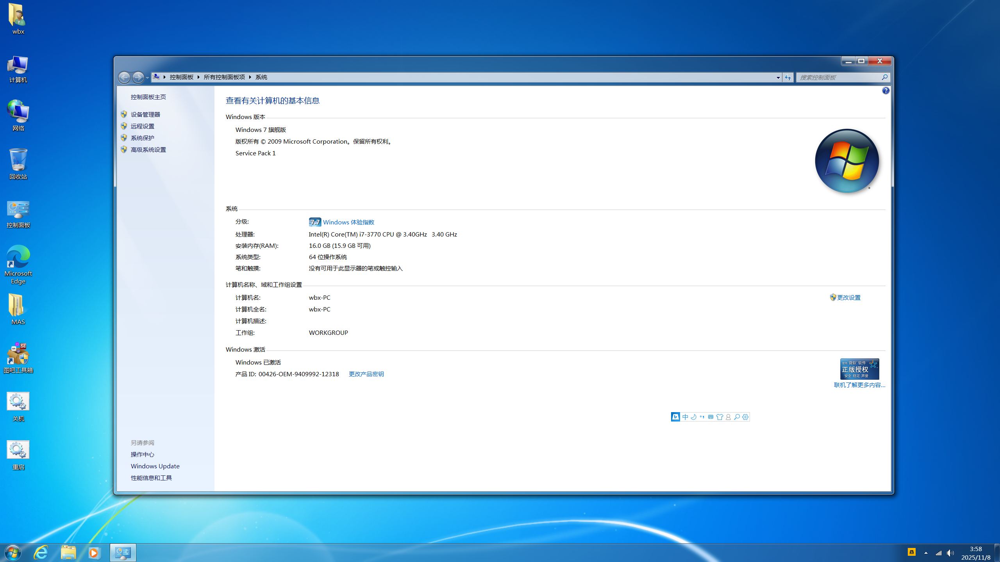
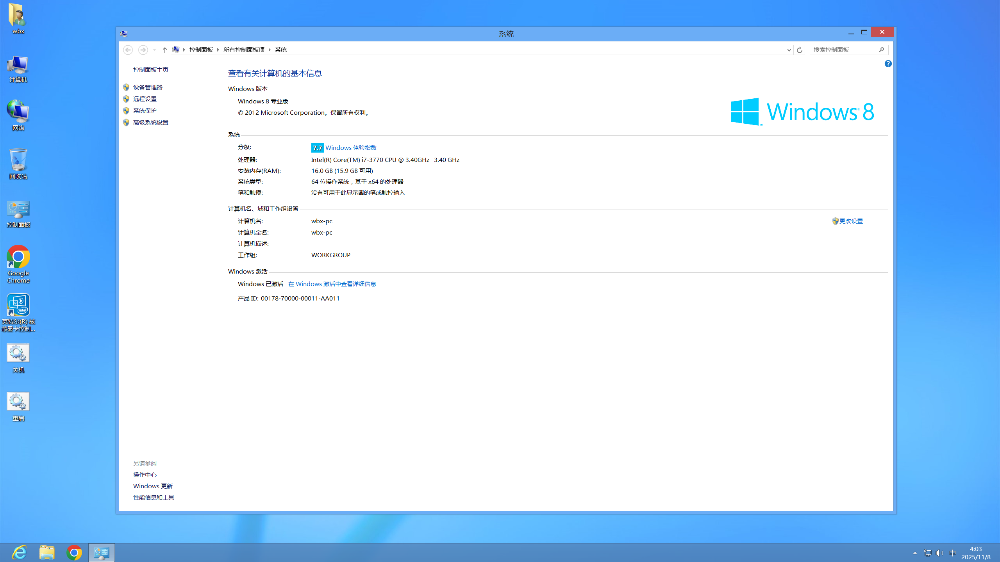
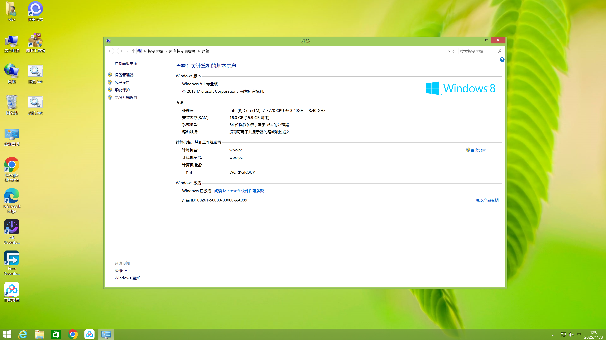
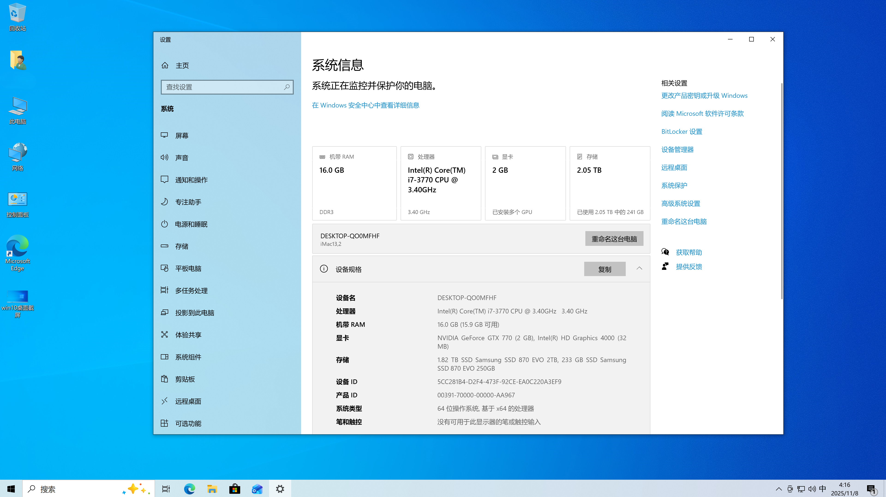
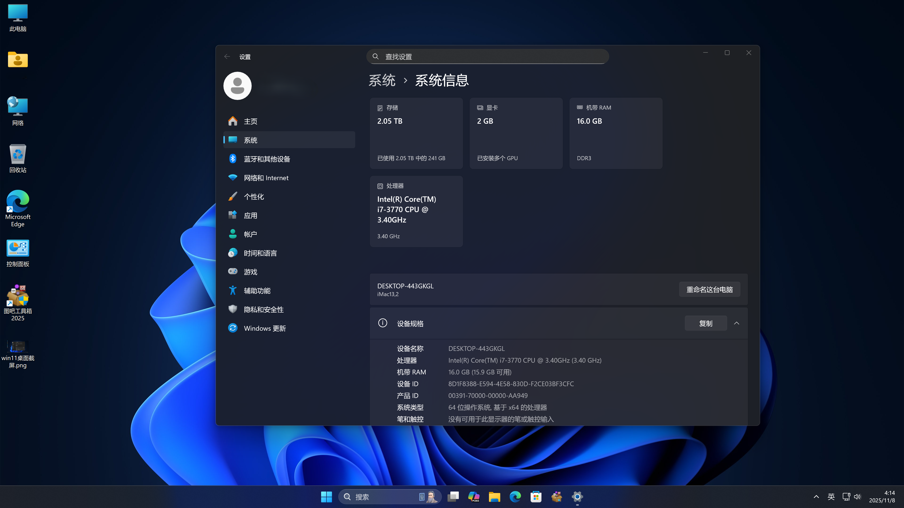

# ASUS-p8z77m-pro-Install-Hackintosh-OS-X-Mountain-Lion-to-macOS-Sequoia-and-WindowsXP-to-Windows11

> macOS 26是Intel Mac可以使用的最后一个macOS版本，在黑苹果即将成为历史的时刻，在一台配备了4K显示器的ivy bridge计算机上以物理机的形式运行了Windows XP-Windows11的所有Windows操作系统以及所有支持4K 60hz hidpi的intel macOS操作系统。


# B站演示视频

https://www.bilibili.com/video/BV1CCkmB2EDs/?vd_source=91b62905f2413020e8ed018369ab5e26

# 配置清单

* 主板： 华硕p8z77m-pro

* CPU： i7-3770

* 内存： 16g ddr3 1600mhz

* 显卡： nvidia gtx770

* SSD1：三星870evo sata 256g

* SSD2：三星870evo sata 2T

* 无线网卡：fenvi-t919

* 显示器：dell S2725QS 4K

* 机箱：乔思伯d32 pro mesh版

* 操作系统：Windows XP-Windows11

* 操作系统：OS X Mountain Lion-macOS Sequoia

# 黑苹果完美程度

## 正常工作：

* 声卡

* 核显

* 独显

* 4K hidpi显示(接显示器完美，接采集卡录屏无法hidpi)

* 有线网卡

* WiFi

* 蓝牙

* 睡眠

* 唤醒

* USB

* 变频

* AppleVTD

## bug

* 在10.8下切换系统，必须先切换到10.9再切换到其他系统，否则其他系统搜不到WIFI信号(包括Windows)，10.8系统会把华硕BE86U的5Ghz WiFi识别成企业级无法使用，连接2.4Ghz WIFI正常。

# 构建重点

### Bootloader 选择

* OpenCore 用于引导黑苹果以及refind
  
  * OpenCore 添加refind启动项
    
    Misc->BlessOverride 下加入条目 \EFI\EFI\refind\refind_x64.efi 即可

* refind用于引导mbr分区表上的Windows XP
  
  * refind.conf 重要设置
    
    ```
    timeout -1 #隐藏refind ui，直接进入目标系统
    scanfor hdbios #仅搜索传统bios引导项
    dont_scan_volumes "2TB" #删除不需要的引导项，禁止扫描指定硬盘(引号里添加引导项名称的子集)
    ```

### 10.8下的声卡驱动

* 华硕的 p8z77m-pro主板的声卡是alc892，AppleALC对于此声卡的支持起始于10.9，笔者自行修改编译了支持alc892声卡在10.8下的AppleALC，在EFI里，直接用即可。(已经向原作者提交了pr，希望能够合并到主分支，链接如下：https://github.com/acidanthera/AppleALC/pull/947)

### 10.8下实现4K 60hz Hidpi

> 首先Mac系统是在10.9.3开始正式支持的4K 60hz hidpi，10.7和10.8只支持低分辨率的Retina，但是物理分辨率无法输出4K，因为当时的白苹果配备的显卡也没有支持4K输出的，黑苹果可用显卡要输出4K，最早的是Nvidia gtx 600系列，而600系列支持的最初版Mac系统是10.8，故而想要4K 60hz hidpi，最起码需要10.8系统起步，显卡支持4K输出是最基本的前提要求。因为10.8没有原生支持4K输出，所以要通过第三方方案实现4K 60hz hidpi。

#### 实现方案

> 由于我的gtx 770 在10.8下最大只能识别2K分辨率，所以要先解决4K输出，再通过命令开启hidpi，具体方案如下。

* 安装Nvidia webdriver，仓库里已经提供。

* openCore NVRAM->Add->7C436110-AB2A-4BBB-A880-FE41995C9F82->boot-args下添加nvda_drv=1，重启。至此已经实现10.8下的4K输出。

* 输入如下命令并重启开启10.8下的hidpi
  
  ```bash
  sudo defaults write /Library/Preferences/com.apple.windowserver DisplayResolutionEnabled -bool YES
  ```

* 设置->显示器里面有两个1080p，一个一个测试，有一个是hidpi (因为毕竟是第三方方案，多少有点bug，所幸效果非常完美)。

##### 至此，您已经成功的在10.8下实现了4K 60hz hidpi。

### 关于SMBIOS选择

#### 安装系统

请选择系统版本支持的SMBIOS

#### 安装完成

* 设置SMBIOS为iMac13,2

* OpenCore下加入如图补丁以跳过board-id检查(EFI文件夹里有完整config.plist文件)
  
  

# 系统桌面截图















